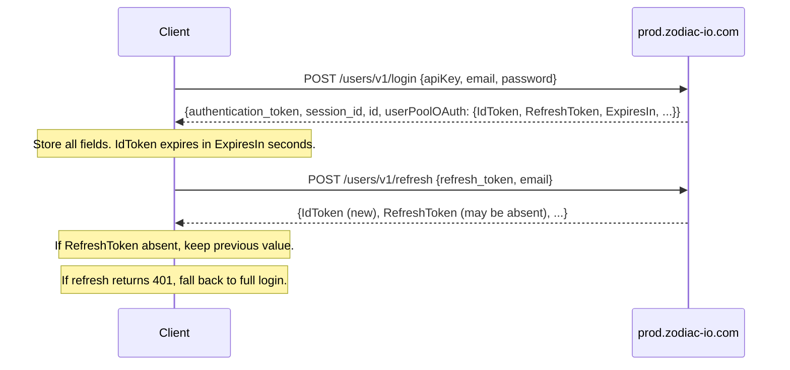

# Client — Authentication and Device Discovery

This document describes the shared authentication flow, token lifecycle, device discovery endpoint, and HTTP client configuration that applies to all system types.

---

## API Families

The iAquaLink platform exposes two distinct API families, each with its own base host:

| Family | Host | Used for |
|---|---|---|
| **Legacy** | `p-api.iaqualink.net` | iQ20 pool controller session commands |
| **Shadow / zodiac-io.com** | `prod.zodiac-io.com` | Authentication, token refresh, EXO/shadow devices |
| **Device registry** | `r-api.iaqualink.net` | Device list, firmware |

All endpoints use HTTPS. There is no HTTP fallback in production.

---

## Authentication

### Login

```
POST https://prod.zodiac-io.com/users/v1/login
Content-Type: application/json
```

**Request body:**

| Field | Type | Description |
|---|---|---|
| `apiKey` | string | Production API key |
| `email` | string | User email address |
| `password` | string | User password |

**Response body (relevant fields):**

| Field | Type | Description |
|---|---|---|
| `authentication_token` | string | Legacy token — sent as query param to iQ20 session and device list |
| `session_id` | string | Session identifier — sent as `sessionID` query param to iQ20 session |
| `id` | integer | Numeric user ID — sent as `user_id` query param to device list |
| `username` | string | |
| `email` | string | |
| `userPoolOAuth.IdToken` | string | Cognito JWT — sent as `Authorization` header to shadow and iQ20 session endpoints |
| `userPoolOAuth.RefreshToken` | string | Opaque refresh token — absent on subsequent refreshes; reuse previous value |
| `userPoolOAuth.AccessToken` | string | Cognito access token (not used by this library) |
| `userPoolOAuth.ExpiresIn` | integer | IdToken TTL in seconds (typically 3600) |
| `userPoolOAuth.TokenType` | string | Always `"Bearer"` |

### Token Refresh

```
POST https://prod.zodiac-io.com/users/v1/refresh
Content-Type: application/json
```

**Request body:**

| Field | Type | Description |
|---|---|---|
| `refresh_token` | string | Value from `userPoolOAuth.RefreshToken` |
| `email` | string | User email address |

**Response body:** Same shape as login. `userPoolOAuth.RefreshToken` may be absent — if so, retain the previously stored refresh token.

### Auth Flow



### Authorization Header Variants

Different endpoints use different auth formats. Both are derived from the same login response:

| Endpoint family | Header name | Value |
|---|---|---|
| iQ20 session (`p-api.iaqualink.net`) | `Authorization` | `{IdToken}` — bare, no `Bearer` prefix |
| Shadow REST (`prod.zodiac-io.com`) | `Authorization` | `{IdToken}` — bare |
| iQ20 session | `api_key` | Production API key |
| Device list | — | Query params only (see below) |

---

## Device Discovery

```
GET https://r-api.iaqualink.net/devices.json
```

**Query parameters:**

| Param | Value |
|---|---|
| `api_key` | Production API key |
| `authentication_token` | From login response |
| `user_id` | `id` field from login response (as string) |

**Response:** JSON array. Each element represents one paired device:

| Field | Type | Description |
|---|---|---|
| `serial_number` | string | Device serial — primary identifier used in all subsequent calls |
| `device_type` | string | Determines which system class handles the device (e.g., `"iQ20"`, `"exo"`) |
| `name` | string | User-assigned name |
| `id` | integer | Numeric device ID |
| `owner_id` | integer | Numeric owner user ID |
| `firmware_version` | string | Current firmware |
| `target_firmware_version` | string or null | Pending OTA target, if any |
| `updating` | boolean | True during OTA in progress |
| `created_at` | string | ISO 8601 timestamp |
| `updated_at` | string | ISO 8601 timestamp |
| `last_activity_at` | string or null | ISO 8601 timestamp of last device contact |

---

## HTTP Client Configuration

Observed reference behavior:

| Parameter | Value |
|---|---|
| Call timeout | 120 s |
| Connect timeout | 30 s |
| Read timeout | 20 s |
| Write timeout | 20 s |
| HTTP/2 | Not explicitly configured in reference (OkHttp negotiates automatically) |
| Certificate pinning | Not observed in reference |
| User-Agent | `okhttp/3.14.7` (set automatically by OkHttp) |
| Retry on connection failure | Not observed in reference |

---

## Error Handling

| HTTP status | Meaning | Observed handling |
|---|---|---|
| 200 | Success | — |
| 400 | Bad request | Error propagated to caller |
| 401 | Unauthorized / bad credentials | Triggers token refresh; if refresh also returns 401, falls back to full login |
| 404 | Not found | Error propagated; client interprets as unauthorized for device list |
| 409 | Conflict | Error propagated |
| 429 | Rate limited | Not explicitly handled in reference; error propagated |
| 500 | Device offline or server error | Error propagated |
| 503 | Service unavailable / timeout | Error propagated |

---

## Deltas vs Current Implementation

| # | Observed reference | Current Python client |
|---|---|---|
| 1 | Login request body field: `apiKey` (camelCase) | Sends `api_key` (snake_case) |
| 2 | `userPoolOAuth.ExpiresIn` returned (token TTL in seconds) | Field is present in response but not used; no token-expiry-based proactive refresh |
| 3 | No explicit HTTP/2 in reference | Python client enables HTTP/2 (`http2=True`) |
| 4 | OkHttp sets `User-Agent: okhttp/3.14.7` implicitly | Python client sets `user-agent: okhttp/3.14.7` explicitly — effective result is the same |
| 5 | No retry interceptor observed | Python client implements reauth retry via `send_with_reauth_retry()` — behaviour extends the reference |
